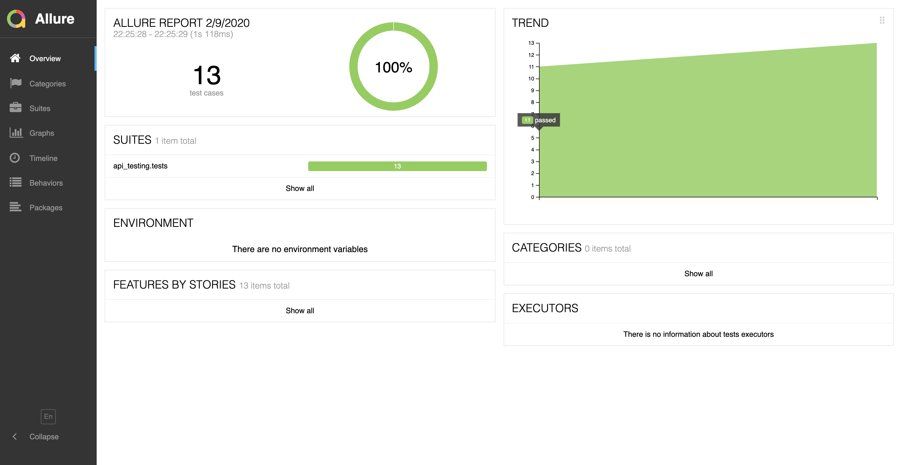
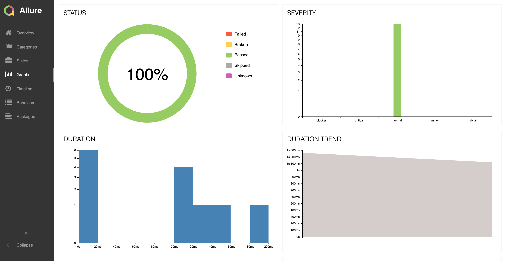
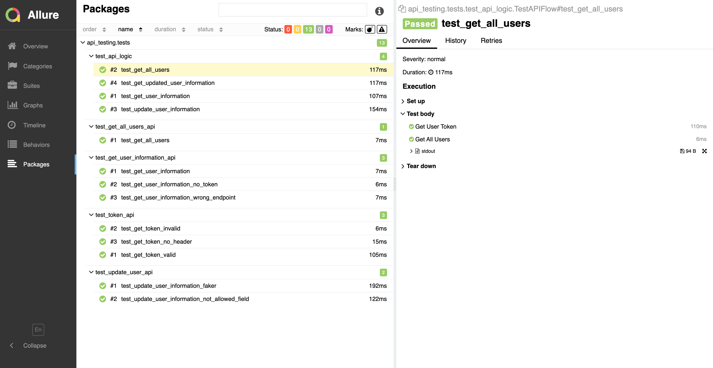

# flasky-api-test

## Structure of Code. ##

api_testing folder contains  
    - api_framework 
    - tests
    
##  api_framework
  
  This folder has: 
  
  - Base API Class which handle low level requests 
  Ex. GET or PUT in Flasky case, and returns response data
  
  - users_api class which inherits base api and has URL and methods defined
  to interact with API.
  
  - api_interface class inherits users_api and is interface between tests and 
  users_api. base url for users_api is provided here.
  
  - utils.py contails helper functions such as creation of Basic auth header, 
  etc.
  
  
  ## tests
  
  This folder contains:
  
  - tests files for e2e flow - test_api_logic.py
  
  - tests files for per api tests
  
  - conftest.py which provide helper functions to read config.json, generate
  fake data for user info updation
  
  - config.json provides env specific information
  
  ## How To Run.
  - Close the repo.
  - Create  virtual env using python 3.7 (.venv)
  - Activate the virtual env ``source .venv/bin/activate`` 
  - ``pip install -r requirements.txt``
  - ``py.test --alluredir=./allure-results/ api_testing/tests``
  - To view test report.
  - ``allure serve ./allure-results ``

## Results  
  
  
  
  
  
  
